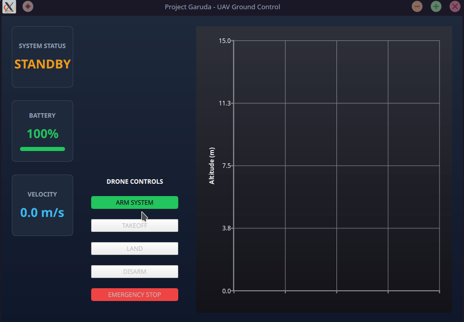
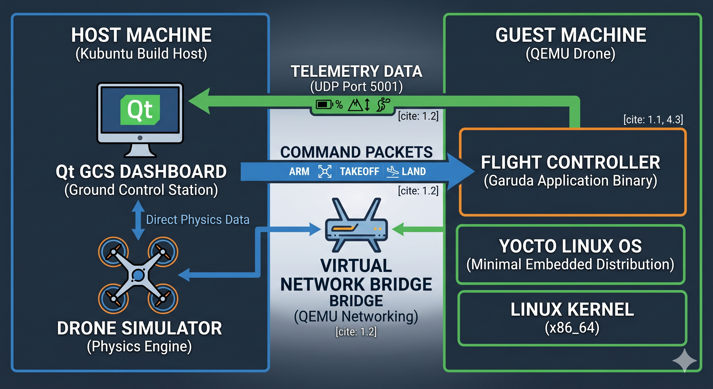

# 🛸 Project Garuda: UAV Telemetry & Control Suite

[](https://github.com/SurKM9/Project-Garuda/actions/workflows/ci.yml)

A high-performance, real-time **Distributed System** designed for Unmanned Aerial Vehicle (UAV) ground control. This suite features a simulated drone flight engine and a modern graphical dashboard, communicating via a custom low-latency binary protocol.



---

## 🚀 Project Overview

Project Garuda demonstrates the integration of low-level Linux systems programming with high-level data visualization. It solves the core challenges of modern robotics: handling asynchronous network data without blocking the user interface or sacrificing performance.

### The System at a Glance:
* **UAV Simulator:** A headless C++ service that simulates flight physics and transmits data at 10Hz using raw UDP sockets.
* **GCS Dashboard:** A multi-threaded Qt 6 application that visualizes telemetry trends and provides a Command & Control (C2) interface.
* **The Bridge:** A thread-safe C++ provider using Mutexes and Atomic flags to move data from network sockets to the QML engine safely.

---

## 🛠 Tech Stack

| Component | Technology |
| :--- | :--- |
| **Language** | C++20 |
| **Framework** | Qt 6.6+ (Quick, Charts, Controls, Widgets) |
| **Networking** | BSD Raw Sockets (UDP / Non-blocking) |
| **Concurrency** | `std::thread`, `std::mutex`, `std::atomic` |
| **Build System** | CMake |
| **Environment** | Linux (Tested on Kubuntu 24.04 / Clang 18) |

---

## 🏗 Architecture

The project is structured into three distinct modules to ensure a clean separation of concerns:

1.  **`UAV_Common`**: The "Contract." Contains memory-packed binary structures (`TelemetryPacket` and `CommandPacket`) to ensure bit-perfect compatibility between the Simulator and the Dashboard.
2.  **`Simulator`**: The "Drone." Manages the flight state machine and an asynchronous command listener. Implements graceful shutdown via Linux signal handling.
3.  **`Dashboard`**: The "Ground Control." Uses a dedicated background worker thread for networking to maintain a responsive 60FPS UI.

---

## 📈 Key Features

* **Real-time Data Visualization:** Dynamic, auto-scaling line charts using Qt Charts for altitude history.
* **Bi-Directional Communication:** Full-duplex UDP link for telemetry downlink (Port 14550) and command uplink (Port 14551).
* **Thread Safety:** Robust data protection using `std::lock_guard` to prevent race conditions.
* **Resource Management:** Follows RAII principles and controlled object destruction order.

---

## ⚡ Setup, Build, and Run

### 1. Install All Dependencies
One-shot command to install the entire development environment on Ubuntu/Kubuntu:

```zsh
sudo apt update && sudo apt install -y \
          build-essential \
          cmake \
          qt6-base-dev \
          qt6-declarative-dev \
          qt6-charts-dev \
          libqt6charts6-dev \
          libxkbcommon-dev \
          libgl1-mesa-dev \
          libvulkan-dev \
          libboost-all-dev \
          doxygen \
          graphviz
```
### 2. Build Instructions
```
mkdir build && cd build
cmake ..
make -j$(nproc)
```

### 3. Run
```
./Simulator/drone_sim
./Dashboard/DashboardApp`
```

📖 API Documentation
This project uses Doxygen for API documentation.

To generate the docs, run make docs in the build folder.

Open build/html/index.html in any browser to view class hierarchies and call graphs.

📜 License
This project is licensed under the MIT License.
